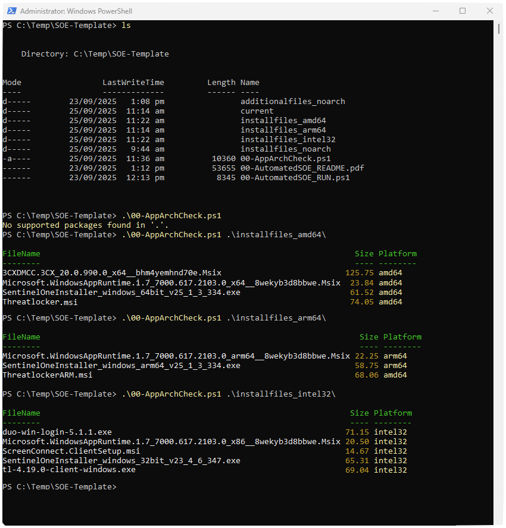
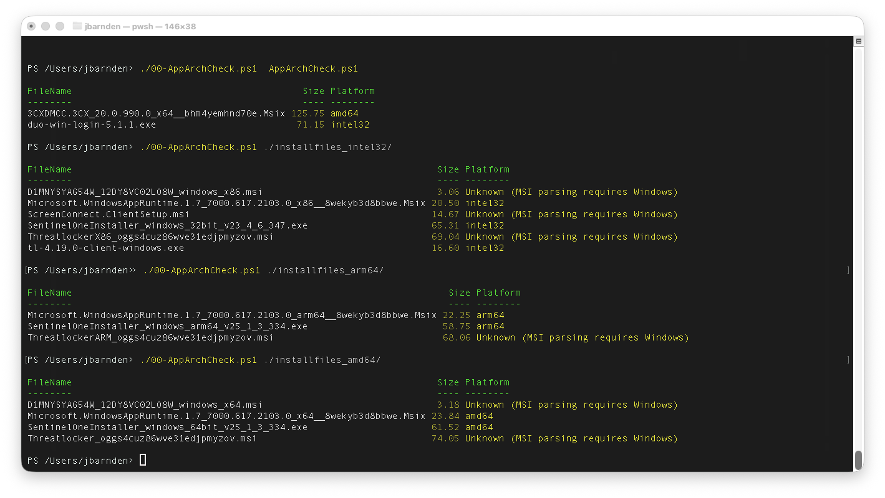

# Windows Application Architecture Checker (AppArchCheck.ps1)

A cross-platform **PowerShell tool** that scans Windows application packages  
(`EXE`, `MSI`, `MSIX`, `APPX`, and bundle variants) to detect their target CPU  
architecture (`x86`, `x64`, `ARM`, `ARM64`, `Itanium`, `Neutral`).  

Works on **Windows PowerShell 5.1** and **PowerShell 7+** across Windows and macOS, Testing on Linux is required.

# Example Screenshots:

Windows - PowerShell 5.1 output:



macOS - PowerShell 7+ output:




---

## Features
- Detects CPU architecture of:
  - Executables (`.exe`)
  - Windows Installer packages (`.msi`)
  - AppX / MSIX packages (`.appx`, `.msix`, `.appxbundle`, `.msixbundle`)
- Cross-platform support (Windows / macOS / Linux)
- Outputs results in a clear table (with colors on PS7+)
- Supports **recursive directory scanning**
- Lightweight, no dependencies beyond PowerShell

---

## Installation
Clone or download this repository, then run the script:

```powershell
git clone https://github.com/justanotherkiwi/Windows-App-Arch-Detector.git
cd AppArchCheck
